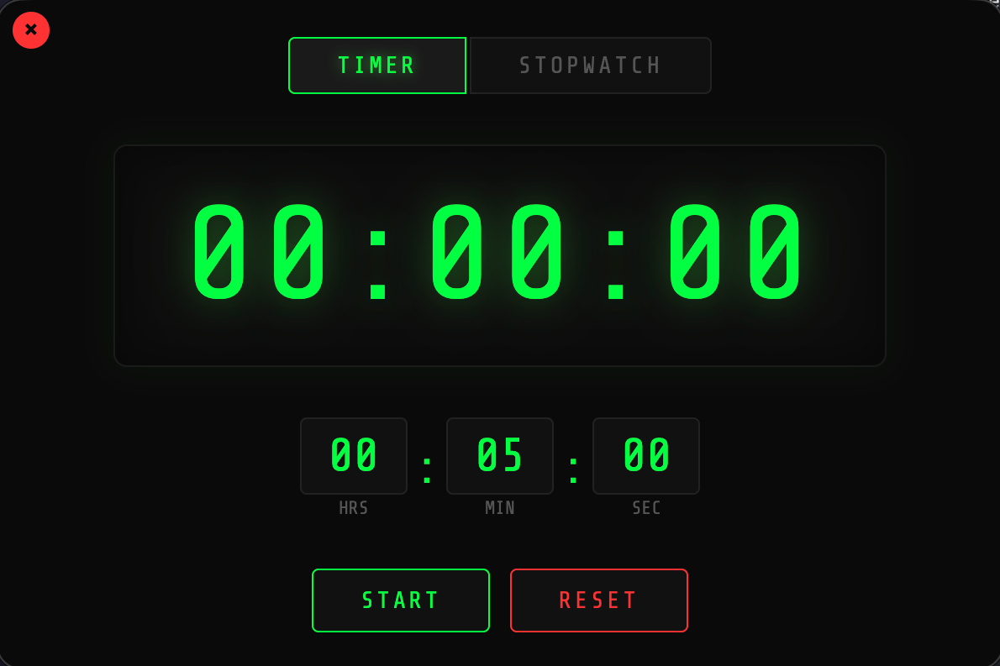

██████╗ ███████╗████████╗██████╗  ██████╗ 
██╔══██╗██╔════╝╚══██╔══╝██╔══██╗██╔═══██╗
██████╔╝█████╗     ██║   ██████╔╝██║   ██║
██╔══██╗██╔══╝     ██║   ██╔══██╗██║   ██║
██║  ██║███████╗   ██║   ██║  ██║╚██████╔╝
╚═╝  ╚═╝╚══════╝   ╚═╝   ╚═╝  ╚═╝ ╚═════╝ 

 ████████╗██╗███╗   ███╗███████╗██████╗ 
 ╚══██╔══╝██║████╗ ████║██╔════╝██╔══██╗
    ██║   ██║██╔████╔██║█████╗  ██████╔╝
    ██║   ██║██║╚██╔╝██║██╔══╝  ██╔══██╗
    ██║   ██║██║ ╚═╝ ██║███████╗██║  ██║
    ╚═╝   ╚═╝╚═╝     ╚═╝╚══════╝╚═╝  ╚═╝

A retro digital timer and stopwatch desktop app built with Electron.

Green-on-black LCD display with ghost digits, two modes (countdown timer and stopwatch), frameless window, and keyboard shortcuts. Runs on macOS, Windows, and Linux.



## Features

- **Timer mode** - set hours, minutes, seconds and count down. Flashes red when finished.
- **Stopwatch mode** - count up from zero.
- **Retro LCD look** - Share Tech Mono font, ghost "88:88:88" digits behind the display.
- **Frameless window** - no OS title bar, draggable, in-app close button.
- **Keyboard shortcuts** - `Space` to start/pause, `R` to reset.

## Development

Requires [Node.js](https://nodejs.org/) (v18+).

```bash
git clone https://github.com/mattkoltun/retro-timer.git
cd retro-timer
npm install
npm start
```

## Building

Build distributable packages using [electron-builder](https://www.electron.build/).

### Build for your current platform

```bash
npm run dist
```

### Build for a specific platform

```bash
npm run dist:mac     # macOS (x64 + arm64)
npm run dist:win     # Windows (x64 + arm64)
npm run dist:linux   # Linux (x64 + arm64)
npm run dist:all     # All platforms
```

Artifacts are written to the `dist/` directory.

### Output formats

| Platform | Formats |
|----------|---------|
| macOS | `.dmg`, `.zip` |
| Windows | `.exe` (NSIS installer), `.zip` |
| Linux | `.AppImage`, `.deb`, `.tar.gz` |

Each format is built for both **x64** (Intel/AMD) and **arm64** (Apple Silicon / ARM) architectures.

> **Note:** Cross-compiling Windows and Linux from macOS works out of the box with electron-builder. Building macOS targets requires a Mac.

## Install via Homebrew

If the app is published to a GitHub release, you can install it with Homebrew:

```bash
brew tap mattkoltun/tap
brew install --cask retro-timer
```

Or install from a local cask file:

```bash
brew install --cask ./timer.rb
```

### Install from a local build

After building, install directly:

**macOS:**
```bash
npm run dist:mac
open dist/RetroTimer-1.0.0-arm64.dmg
# Drag RetroTimer.app to Applications
```

**Linux (deb):**
```bash
npm run dist:linux
sudo dpkg -i dist/retro-timer_1.0.0_amd64.deb
```

**Linux (AppImage):**
```bash
npm run dist:linux
chmod +x dist/RetroTimer-1.0.0.AppImage
./dist/RetroTimer-1.0.0.AppImage
```

**Windows:**
```bash
npm run dist:win
# Run "dist/RetroTimer Setup 1.0.0.exe"
```

## License

[MIT](LICENSE)
